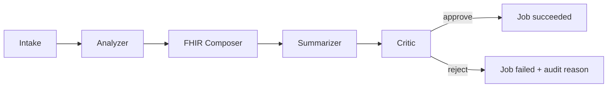

# AGENTS.md — Per-agent contracts

This file is the authoritative source for **what each agent in the RxLab Agentic pipeline does**, the exact **shape of its inputs and outputs**, and (for the Bedrock-backed agents) the **prompt rules and refusal cases**.

> Lock these contracts before writing code. Changes here drive code; not the other way around.

The pipeline:



Three agents are **deterministic** (rule-based). Two agents call **Bedrock** (Claude Haiku). The **Critic** is a guardrail that gates AI output before publication.

---

## 1. `intake` — VCF validation and sample classification

| Field | Value |
| --- | --- |
| Compute | Lambda zip (Python) |
| Determinism | Deterministic |
| Bedrock? | No |
| Owns | VCF parsing, schema validation, sample classification |

### Input

```json
{
  "job_id": "j_<id>",
  "sample_id": "S-<id>",
  "vcf_url": "s3://<bucket>/<key>.vcf",
  "correlation_id": "<uuid>"
}
```

### Output

```json
{
  "job_id": "j_<id>",
  "sample_id": "S-<id>",
  "sample_class": "exome | panel | other",
  "variants": [
    { "chrom": "10", "pos": 96541616, "ref": "G", "alt": "A", "gene": "CYP2C19" }
  ],
  "warnings": ["..."]
}
```

### Failure modes

- `INVALID_VCF_SCHEMA` — required headers missing or malformed
- `UNREACHABLE_VCF` — S3 GetObject failed
- `EMPTY_VCF` — no variant rows

---

## 2. `analyzer` — CPIC subset rule engine

| Field | Value |
| --- | --- |
| Compute | Lambda container (Python; CPIC rule data baked into image) |
| Determinism | Deterministic |
| Bedrock? | No |
| Owns | Mapping variants → gene/genotype calls → CPIC recommendations |

### Input

The output of `intake` (`variants` + sample metadata).

### Output

```json
{
  "job_id": "j_<id>",
  "calls": [
    {
      "gene": "CYP2C19",
      "genotype": "*1/*2",
      "phenotype": "Intermediate Metabolizer",
      "cpic_recommendations": [
        {
          "drug": "clopidogrel",
          "recommendation": "Consider alternative antiplatelet therapy",
          "citation": "CPIC: Clopidogrel and CYP2C19 — 2022 update"
        }
      ]
    }
  ]
}
```

### Failure modes

- `NO_RULES_APPLY` — no rule in the CPIC subset matched (job continues with empty `calls`; not an error)
- `CONFLICTING_GENOTYPE` — two contradictory calls for the same gene
- `RULE_DATA_LOAD_ERROR` — CPIC subset file failed to load (container regression)

---

## 3. `fhir_composer` — Map to FHIR R4 Bundle

| Field | Value |
| --- | --- |
| Compute | Lambda zip (Python) |
| Determinism | Deterministic |
| Bedrock? | No |
| Owns | Building the FHIR Bundle |

### Output

A FHIR R4 `Bundle` (type=`collection`) containing:

- One `Observation` per gene/genotype call
- One `MedicationStatement` per CPIC recommendation
- A placeholder `DocumentReference` (populated later if and only if Critic approves)

Written to S3 at `s3://<reports-bucket>/<job_id>/bundle.json` with KMS encryption.

### Failure modes

- `S3_WRITE_FAILED`
- `INVALID_FHIR_PAYLOAD` — assembled bundle fails internal schema validation

---

## 4. `summarizer` — Bedrock Claude Haiku (plain-English summary)

| Field | Value |
| --- | --- |
| Compute | Lambda zip (Python) |
| Determinism | **Non-deterministic** (LLM) |
| Bedrock? | **Yes** — Claude Haiku |
| Owns | Producing a clinician-readable summary as structured JSON |

### Bedrock call constraints

- Model id: from SSM `/rxlab/<env>/bedrock/model_id` (default `anthropic.claude-3-haiku-20240307-v1:0`).
- `max_tokens`: **hard cap, 512**.
- `temperature`: **0.2**.
- JSON mode (or equivalent constrained output) **required**.
- Output is parsed and validated against a pydantic `SummarizerOutput` schema before persistence.

### Output schema (`SummarizerOutput`)

```json
{
  "summary": "<= 2 short paragraphs of plain English>",
  "key_findings": [
    { "gene": "CYP2C19", "phenotype": "Intermediate Metabolizer", "drug": "clopidogrel" }
  ],
  "citations": [
    { "source": "CPIC", "guideline": "Clopidogrel and CYP2C19 — 2022 update" }
  ],
  "confidence": 0.0
}
```

### Failure modes

- `BEDROCK_ERROR` — any Bedrock service-side error
- `TOKEN_BUDGET_EXCEEDED` — per-job token budget exhausted (audit row written, job fails cleanly)
- `INVALID_LLM_OUTPUT` — model returned non-JSON or schema mismatch (retried once, then fails)

### What this agent will **not** do

- Will not include patient demographics in the summary.
- Will not invent CPIC citations — `citations` must be drawn from the Analyzer's recommendation list.
- Will not output drugs that are not present in the Analyzer's `calls[].cpic_recommendations[].drug` set.

---

## 5. `critic` — Bedrock Claude Haiku (safety review / guardrail)

| Field | Value |
| --- | --- |
| Compute | Lambda zip (Python) |
| Determinism | **Non-deterministic** (LLM), **plus deterministic post-checks** |
| Bedrock? | **Yes** — Claude Haiku |
| Owns | Approve or reject the Summarizer's output before publishing |

### Bedrock call constraints

Same as `summarizer` (model id from SSM, hard token cap, JSON mode, schema-validated output).

### Output schema (`CriticVerdict`)

```json
{
  "verdict": "approve | reject",
  "reasons": ["missing_cpic_citation", "unknown_drug_name", "low_confidence"],
  "notes": "<= 1 short paragraph explaining the decision>"
}
```

### Refusal cases (Phase 5 — Critic v2)

The Critic **must reject** when any of the following is true:

1. **`missing_cpic_citation`** — the Summarizer output does not include a structured CPIC citation for at least one finding.
2. **`unknown_drug_name`** — the Summarizer mentions a drug not on the allowlist derived from the Analyzer's `cpic_recommendations[].drug` list.
3. **`low_confidence`** — `confidence < 0.6` (threshold tunable via SSM).

The Critic's verdict is written to the `audit` DynamoDB table along with `tokens_used`, `latency_ms`, and `correlation_id`.

### What happens on `reject`

- DynamoDB `jobs` row is updated to `status=failed, reason=<first refusal reason>`.
- The unsafe text **is never written** to S3 as a `DocumentReference`.
- Alarms are not triggered by a refusal (refusal is a normal outcome, not an error).

### What happens on `approve`

- The summary is written as a `DocumentReference` into the FHIR Bundle at `s3://<reports-bucket>/<job_id>/bundle.json`.
- DynamoDB `jobs` row is updated to `status=succeeded, report_ready=true`.

---

## Cross-cutting contract

Every agent:

- Receives a `job_id` and `correlation_id` in its event; both are echoed in every log line.
- Logs via the shared `service/common/logging.py` JSON logger.
- Reports its outcome to Step Functions; SFN persists per-step state to DynamoDB `agent_runs`.
- Emits a CloudWatch metric `RxLab/Agents/<AgentName>/InvocationCount` and `.../ErrorCount`.
- Tracing (`Tracing = "Active"`) is set on the Lambda; X-Ray segments tie back to the SFN execution.
