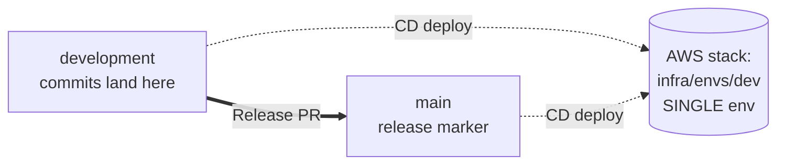

# RxLab Agentic — Build Plan (repo-internal)

> This is the repo-internal mirror of [`../project-overview/PLAN.md`](../project-overview/PLAN.md). The authoritative plan lives in `project-overview/`; this file is here so anyone cloning **just `rxlab-agentic/`** still has the plan on hand.

**Project:** RxLab Agentic
**Assessment:** CVS — Senior Platform Engineer Take-Home
**Variant:** Multi-agent pharmacogenomic analysis platform
**Bedrock:** Real Bedrock (Claude Haiku) with strict budget caps + off-switch
**Packaging:** Lambda zips + ECR container image (Analyzer)

## Branch & Environment Model (2 branches, 1 environment)

This repo uses **two long-lived branches** and **one AWS environment**:

- `development` — integration. **All commits land here directly.** Pushes auto-deploy to the single AWS stack (`infra/envs/dev`).
- `main` — release marker. Updated only by merging the **Release PR** `development -> main`. The merge re-deploys the **same** stack.

There are **no short-lived feature branches** for normal work, and **no second AWS environment** (see DECISIONS.md ADR-010).

### Release PR for the assessment

The Release PR (`development -> main`) carries the AI iteration story (Claude Code excerpts, rejected suggestions, course corrections, link to `docs/ai-journal.md`). Merging it triggers `cd-deploy.yml` to re-apply `infra/envs/dev` end-to-end, proving the promotion flow without spinning up a duplicate environment.



## Phased Commit Plan (10 commits on `development`)

| Phase | Theme | Commits |
| --- | --- | --- |
| 1 | Foundations (repo skeleton + AI workflow files + Terraform modules) | 2 |
| 2 | Service & deterministic pipeline (API + intake + analyzer + fhir_composer + SFN) | 2 |
| 3 | Bedrock agents (Summarizer + Critic v1) + observability | 2 |
| 4 | CI/CD (GitHub Actions) + docs + diagrams + demo/teardown scripts | 2 |
| 5 | Critic guardrails iteration (CPIC citation + drug allowlist + ai-journal entries) | 2 |
| Release | OPEN Release PR `development -> main` at submission | 0 |

See [`../project-overview/03-STEP-BY-STEP.md`](../project-overview/03-STEP-BY-STEP.md) for the full per-phase playbook.

## Repo layout

```
rxlab-agentic/
  README.md
  DECISIONS.md
  CLAUDE.md
  AGENTS.md
  PLAN.md                    # this file
  docs/
    ai-journal.md
    api.md
    fhir-mapping.md
    baseline-check-prep.md
  diagrams/
  service/
    common/                  # shared pydantic models, logging, errors
    api/
      submit_job/            # Lambda (zip)
      get_job/
      get_report/
      healthz/
    agents/
      intake/                # zip
      analyzer/              # container
      fhir_composer/         # zip
      summarizer/            # zip, Bedrock
      critic/                # zip, Bedrock + guardrails
    canary/
    tests/
      unit/
      integration/
      contract/
  infra/
    envs/
      dev/
      prod/
    modules/
      kms-key/
      s3-bucket-secure/
      dynamodb-table/
      lambda-fn/
      lambda-container/
      api-gateway-http/
      step-functions-pipeline/
      sns-alerts/
      bedrock-access/
      observability/
  .github/
    workflows/
  scripts/
```

## Quick links

- Assessment requirements: [`../project-overview/requirements.md`](../project-overview/requirements.md)
- Full plan & rationale: [`../project-overview/PLAN.md`](../project-overview/PLAN.md)
- Project explained: [`../project-overview/01-PROJECT-EXPLAINED.md`](../project-overview/01-PROJECT-EXPLAINED.md)
- Architecture: [`../project-overview/02-ARCHITECTURE.md`](../project-overview/02-ARCHITECTURE.md)
- Step-by-step playbook: [`../project-overview/03-STEP-BY-STEP.md`](../project-overview/03-STEP-BY-STEP.md)
- Demo & interview prep: [`../project-overview/04-DEMO-AND-INTERVIEW.md`](../project-overview/04-DEMO-AND-INTERVIEW.md)
- Glossary: [`../project-overview/05-GLOSSARY.md`](../project-overview/05-GLOSSARY.md)
- AWS + GitHub setup: [`../project-overview/06-AWS-GITHUB-SETUP.md`](../project-overview/06-AWS-GITHUB-SETUP.md)
