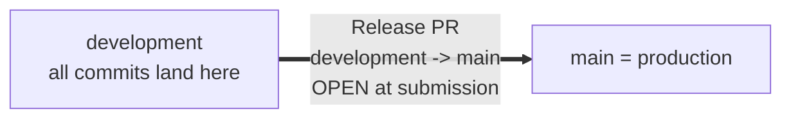

# RxLab Agentic

> **Internal Developer Platform** that exposes a self-service API for pharmacogenomic (PGx) analysis. A developer `POST`s a VCF file; the platform returns a clinical-grade **FHIR R4 Bundle** with a Bedrock-generated summary that has passed a Critic safety review.

This is an AWS-native, Terraform-deployed, GitHub Actions-CI/CD'd multi-agent service built for the CVS Senior Platform Engineer take-home assessment.

> **Status:** C1–C12 implemented in-repo. Deploy with `scripts/bootstrap.sh` then `terraform apply` in `infra/envs/dev`. CI/CD workflows run on push to `development` / `main`.

## Quick facts

| | |
| --- | --- |
| Cloud | AWS (Free Tier compatible, near $0) |
| Compute | AWS Lambda + Step Functions Express |
| AI | Amazon Bedrock — Claude Haiku |
| Data | DynamoDB (job + audit) + S3 (FHIR reports) |
| API | API Gateway HTTP API (4 endpoints) |
| Languages | Python (service) + Terraform (infra) + YAML (CI) |
| CI/CD | GitHub Actions with OIDC (no long-lived AWS keys) |
| **Branch model** | **2 long-lived branches only: `development` + `main`** |

## Branch & release model (read this first)

This project uses **only two long-lived branches**:

- **`development`** — integration / staging. **All commits land here directly.** Pushes auto-deploy to the dev AWS environment (once Phase 4 CI is in place).
- **`main`** — production. Updated only by merging the **Release PR** `development -> main`.

There are **no short-lived feature branches** for normal work. If you want to gate a single risky change with CI, you may open an optional ad-hoc PR into `development`, but the default flow is to commit and push directly.

The **Release PR (`development -> main`) is intentionally left OPEN at submission** to satisfy the assessment's "leave at least one PR open showing AI-assisted development" requirement. Its description carries the AI workflow story; merging it (post-interview) triggers the env-protected production deploy.



## Deploy / demo / teardown

```bash
# One-time remote state bootstrap (see project-overview/06-AWS-GITHUB-SETUP.md):
bash scripts/bootstrap.sh

# Apply dev stack:
cd infra/envs/dev && terraform init && terraform apply

# First deploy: push Analyzer image before Lambda can start:
make push-analyzer IMAGE_TAG=bootstrap

# Live end-to-end demo against the dev environment:
export API_URL="$(terraform -chdir=infra/envs/dev output -raw api_url)"
bash scripts/demo.sh

# Tear dev stack down (keeps remote state bucket):
bash scripts/teardown.sh
```

Local verification before push:

```bash
make lint && make test && make tf-validate
```

## Project documents

| Document | Purpose |
| --- | --- |
| [`PLAN.md`](PLAN.md) | Repo-internal mirror of the build plan |
| [`DECISIONS.md`](DECISIONS.md) | ADRs (architecture, packaging, Bedrock, branch model, …) |
| [`CLAUDE.md`](CLAUDE.md) | Mission + conventions for AI tools working in this repo |
| [`AGENTS.md`](AGENTS.md) | Per-agent contracts (inputs, outputs, prompts, refusal cases) |
| [`docs/ai-journal.md`](docs/ai-journal.md) | Chronological log of AI interactions, course corrections, rejected suggestions |
| [`docs/api.md`](docs/api.md) | OpenAPI / endpoint reference |
| [`docs/fhir-mapping.md`](docs/fhir-mapping.md) | Analyzer output → FHIR R4 resource mapping |
| [`docs/baseline-check-prep.md`](docs/baseline-check-prep.md) | No-AI interview prep notes |
| [`diagrams/`](diagrams/) | `.drawio.xml` + `.png` architecture and state-machine diagrams |

The authoritative project overview lives one level up at [`../project-overview/`](../project-overview/).

## Repo layout

```
rxlab-agentic/
  service/                   # Python service code (Phase 2+)
    common/                  # shared pydantic models, logging, errors
    api/                     # 4 API Lambdas (submit_job, get_job, get_report, healthz)
    agents/                  # 5 agent Lambdas (intake, analyzer, fhir_composer, summarizer, critic)
    canary/                  # scheduled health-check Lambda
    tests/{unit,integration,contract}
  infra/                     # Terraform (Phase 1+)
    envs/{dev,prod}
    modules/{kms-key, s3-bucket-secure, dynamodb-table, lambda-fn, lambda-container,
             api-gateway-http, step-functions-pipeline, sns-alerts, bedrock-access,
             observability}
  .github/workflows/         # GitHub Actions (Phase 4)
  scripts/                   # bootstrap.sh, demo.sh, teardown.sh
  diagrams/                  # architecture + state-machine drawio
  docs/                      # ai-journal, api, fhir-mapping, baseline prep
  .cursor/rules/             # Cursor coding rules (no-wildcard-iam, always-typed, …)
```

## Prerequisites (for the developer building this)

- AWS account with Bedrock model access granted for `anthropic.claude-3-haiku-20240307-v1:0` in `us-east-1`
- AWS CLI v2 configured
- Terraform 1.7+
- Python 3.11+
- Docker Desktop (for the Analyzer container build)
- `jq`, `make`, `pre-commit`, `tflint`, `tfsec`, `checkov`, `trivy`

See [`../project-overview/06-AWS-GITHUB-SETUP.md`](../project-overview/06-AWS-GITHUB-SETUP.md) for the full one-time AWS + GitHub setup.

## License

MIT — see [`LICENSE`](LICENSE).
